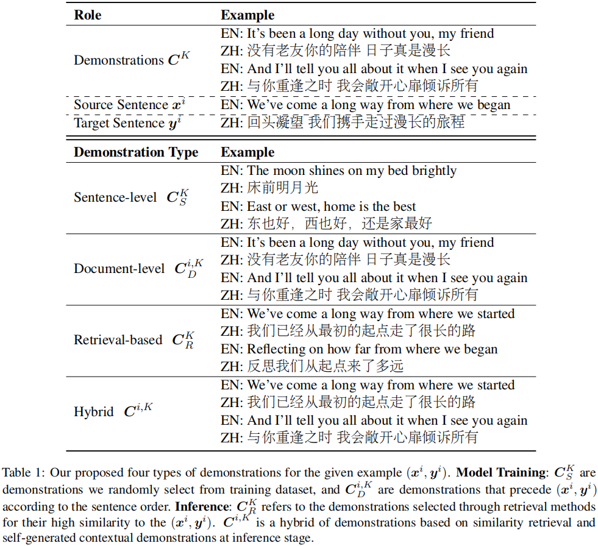

# Towards Demonstration-Aware Large Language Models for Machine Translation
##  Overview
Tuning-based large language models for machine translation (aka large translation model, LTM) have demonstrated significant performance in the field of machine translation. Despite their success, these models often face difficulties in leveraging demonstrations to further improve their performance. To tackle this challenge, we introduce a novel approach that integrates demonstration-aware training and inference strategies within the framework of tuning-based LTMs, hereby referred to as demonstration-aware LTMs.During training, we enrich the model's learning process by incorporating both sentence- and document-level demonstrations derived from its original training dataset. During inference, the model synergizes its own contextual translations with retrieved high-quality demonstrations, leading to more precise and contextually appropriate outputs.Empirical results reveal that our demonstration-aware LTM not only mitigates the negative impacts traditionally associated with demonstrations, but also secures substantial improvements in translation accuracy, particularly in domain-specific and document-level translation tasks.
### Four types of demonstrations
<div align="center">
    </img>
</div>

## Installation
```bash
git clone https://github.com/ChenLi0620/Demonstration-Aware.git
cd Demonstration-Aware
pip install -r requirements.txt
```
## Download Trained Models
:hugs: Try our models at HuggingFace model hub:
  -  [[Demonstraion-Aware_LTM-7B]](https://huggingface.co/ChenLi0620/Demonstraion-Aware_LTM-7B)
  -  [[Demonstraion-Aware_LTM-13B]](https://huggingface.co/ChenLi0620/Demonstraion-Aware_LTM-13B)
## Training 
For all training, we use deepspeed ZeRO-2, please see our configuration file at `train/config/deepspeed_config_zero2.json`.
### Demonstration-Aware Model Training (Full-Weight)
To train the model with our demonstration-aware training method, execute the following command:
```
bash train/runs/ft.sh ${output_dir} $language_pairs$
```
where `language_pairs` is the translation directions you considered. The default is all 10 directions: `de-en,cs-en,is-en,zh-en,ru-en,en-de,en-cs,en-is,en-zh,en-ru`.

### Demonstration-Aware Model Training (LoRA)
There's also an option to employ LoRA for demonstration-aware model training. To do so, execute the following command:
```
bash runs/parallel_ft_lora.sh ${your_output_dir} $training_pairs$
```
## Evaluation 
### Evaluation on our models 
This is a quick start to evaluate model with zero-shot.
```
python run_llmmt.py \
    --model_name_or_path  ${MODEL_DIR} \
    --do_predict \
    --language_pairs ${TEST_PAIRS} \
    --mmt_data_path ./data/data/eval/it \
    --per_device_eval_batch_size 2 \
    --output_dir ${OUTPUT_DIR} \
    --predict_with_generate \
    --max_new_tokens 256 \
    --max_source_length 256 \
    --fp16 \
    --seed 42 \
    --num_beams 5 
```
The generated outputs will be saved in the `OUTPUT_DIR`. The variable language_pairs denotes the translation directions you wish to evaluate, You can choose the `TEST_PAIRS` in 10 directions: `de-en,cs-en,is-en,zh-en,ru-en,en-de,en-cs,en-is,en-zh,en-ru`.

There's also an option to employ LoRA for demonstration-aware model translation. To do so, execute the following command:
```
bash eval/evals/eval_base_lora.sh
```
### Evaluation in Domain Translation
To evaluate the domain translation performance with retrieval-based demonstrations, you can execute the following command:
```
bash eval/evals/eval_demo_retrieval.sh
```
### Evaluation in Documnet-level Translation
To evaluate the documnet-level translation performance with hybrid-based demonstrations, you can execute the following command:
```
bash eval/evals/eval_demo_hybrid.sh
```
## License
Distributed under the MIT License. See `LICENSE.txt` for more information.
## Contact
If you have any questions related to the code or the paper, feel free to email Chen Li (lichen@stu.hit.edu.cn).
## Citation
If you find this repo useful, please cite our [paper](https://aclanthology.org/2024.acl-long./):
